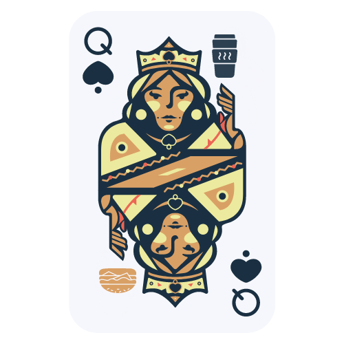
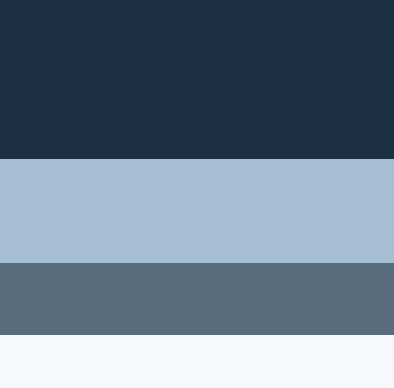
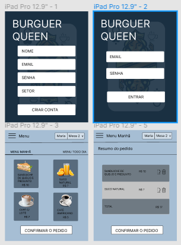
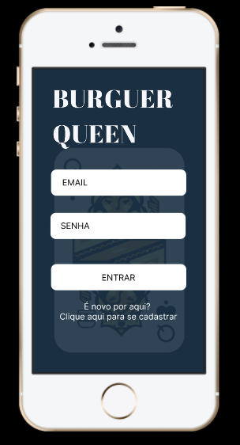
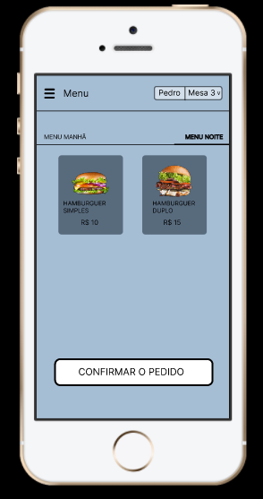
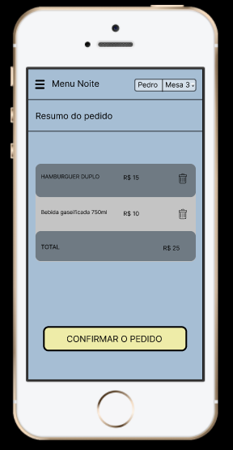

# Burger Queen (API Client)

## Burger Queen Hamburgueria 🍔

## Índice

* [1. Resumo do projeto](#1-resumo-do-projeto)
* [2. Definição do produto](#2-definição-do-produto)
* [3. UX/ UI Designer](#3-UX/-UI-Designer)
* [4. Tecnologias utilizadas](#5-critérios-mínimos-de-aceitação-do-projeto)
* [5. Considerações Finais](#6-hacker-edition)
***

## 1. Resumo do projeto

Um pequeno restaurante de hambúrgueres, que está crescendo, necessita uma
interface em que se possa realizar pedidos utilizando um _tablet_, e enviá-los
para a cozinha para que sejam preparados de forma ordenada e eficiente.

Este projeto tem duas áreas: interface (cliente) e API (servidor). Nosso
cliente nos pediu para desenvolver uma interface que se integre com a API.

Desta vez temos um projeto 100% por demanda. Você sempre pode (e deve) fazer
sugestões de melhora e mudança, mas muitas vezes trabalhará em um projeto em que
primeiro deve se assegurar de cumprir os requisitos.

Estas são as informações que temos do cliente:

> Somos **Burger Queen**, um fast food 24hrs.
>
>A nossa proposta de serviço 24 horas foi muito bem recebida e, para continuar a
>crescer, precisamos de um sistema que nos ajude a receber pedidos de nossos
>clientes.
>
>Nós temos 2 menus. Um muito simples para o café da manhã:
>
>| Ítem                      |Preço R$|
>|---------------------------|------|
>| Café americano            |    5 |
>| Café com leite            |    7 |
>| Sanduíche de presunto e queijo|   10 |
>| Suco de fruta natural     |    7 |
>
>E outro menu para o resto do dia:
>
>| Ítem                      |Preço |
>|---------------------------|------|
>|**Hambúrgueres**           |   **R$**   |
>|Hambúrguer simples         |    10|
>|Hambúrguer duplo           |    15|
>|**Acompanhamentos**        |   **R$**   |
>|Batata frita               |     5|
>|Anéis de cebola            |     5|
>|**Bebidas**                |   **R$**   |
>|Água 500ml                 |     5|
>|Água 750ml                 |     7|
>|Bebida gaseificada 500ml   |     7|
>|Bebida gaseificada 750ml   |    10|
>
> **Importante:** Os clientes podem escolher entre hambúrgueres de carne bovina,
> frango ou vegetariano. Além disso, por um adicional de R\$ 1,00 , eles podem
> adicionar queijo **ou** ovo.
>
>Nossos clientes são bastante indecisos, por isso é muito comum que eles mudem o
>seu pedido várias vezes antes de finalizar.

A interface deve mostrar os dois menus (café da manhã e restante do dia), cada
um com todos os seus _produtos_. O usuário deve poder escolher que _produtos_
adicionar e a interface deve mostrar o _resumo do pedido_ com o custo total.

## 2. Definição do Produto

Um sistema de comanda de pedidos para acesso de garçon/garçonete e chef de cozinha para uma hamburgueria de atentimento 24hs.
A temática foi inspirada no nome do projeto *"Burger Queen"*, a aplicação é uma SPA (Single Page Aplication) e tem um designer responsivo.

## 3. UX/ UI Designer

O projeto foi criado a partir do conceito *"first mobile"*, mas originalmente seu uso foi pensado para *tablet's*, porém o produto foi trabalhado para atender diversos tamanhos de tela conforme a necessidade do usuário.

O designer do projeto foi criado a partir do próprio nome, o objetivo é transmitir uma imagem rústica como a temática da lanchonete, porém com um visual agradável ao usuário.

### Paleta de cores

As cores usadas foram definidas a partir da logo da hamburgueria, o uso de tons mais neutros e sóbrios foi pensando no conforto do usuário.

### Protótipos

#### Tablet:

#### Mobile:

## 4. Tecnologias utilizadas

- HTML 
- CSS (module)
- JSX
- Node JS
- Git
- GitHub
- Jest
- React
- API
- Figma
- Canvas
- Slack

## 5. Considerações finais

Esse projeto está sendo desenvolvido pela dev Anna Ferraz, quarto projeto do bootcamp da Laboratória, turma SAP007.

<table>
  <tr>
    <td align="center">
      <a href="www.linkedin.com/in/anna-ferraz">    
  
      <h1>LinkedIn: Anna Ferraz</h1>
  
      </a>
    </td>
</table>

